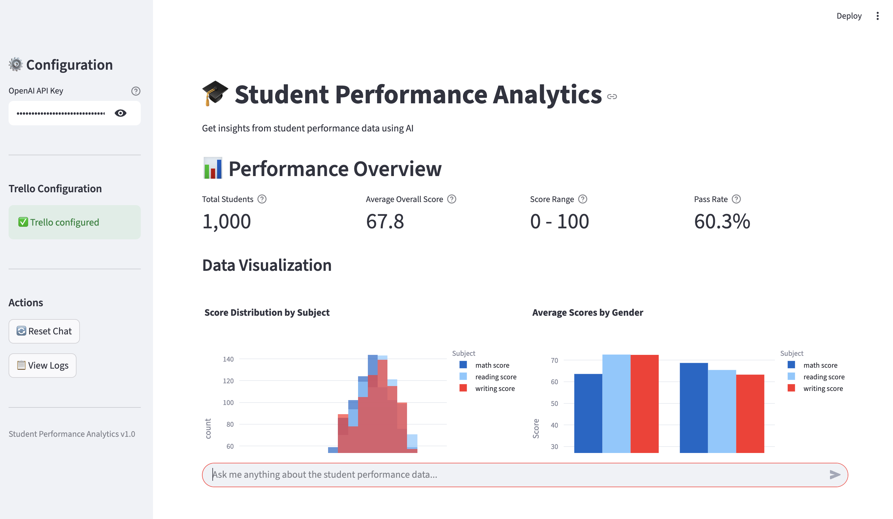
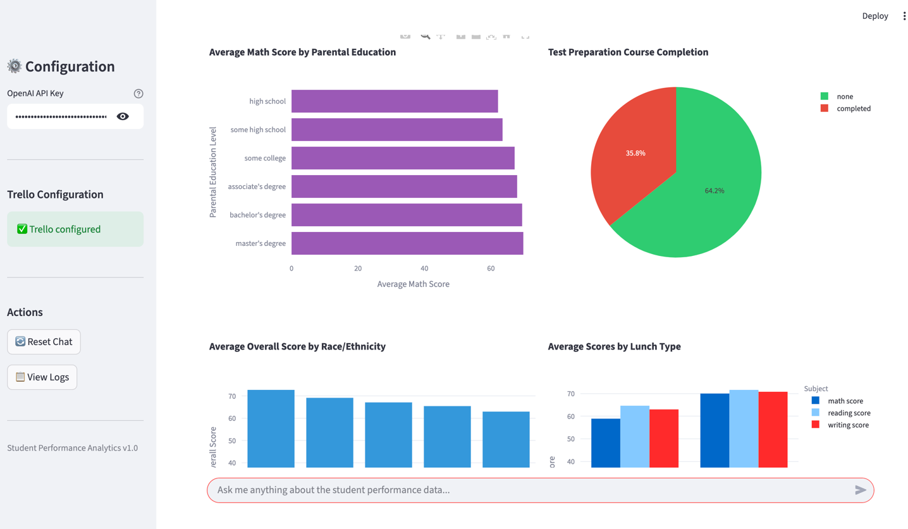
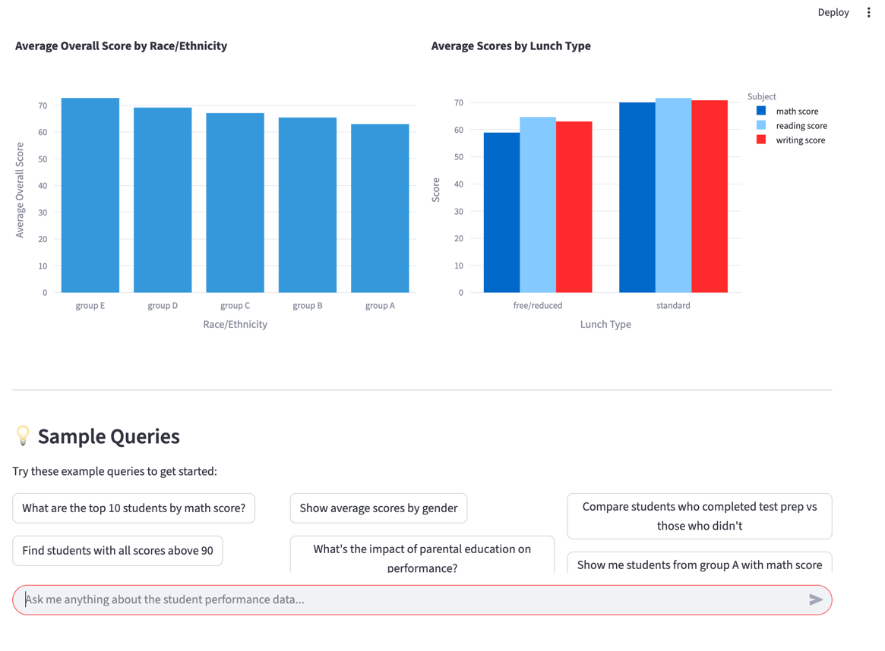
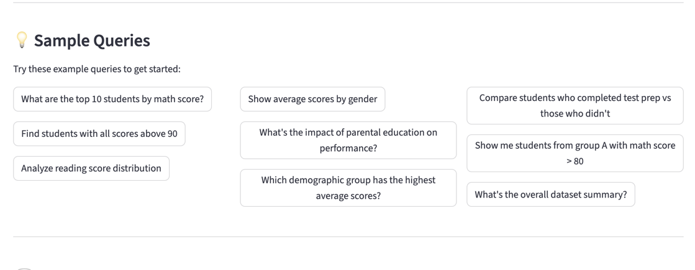
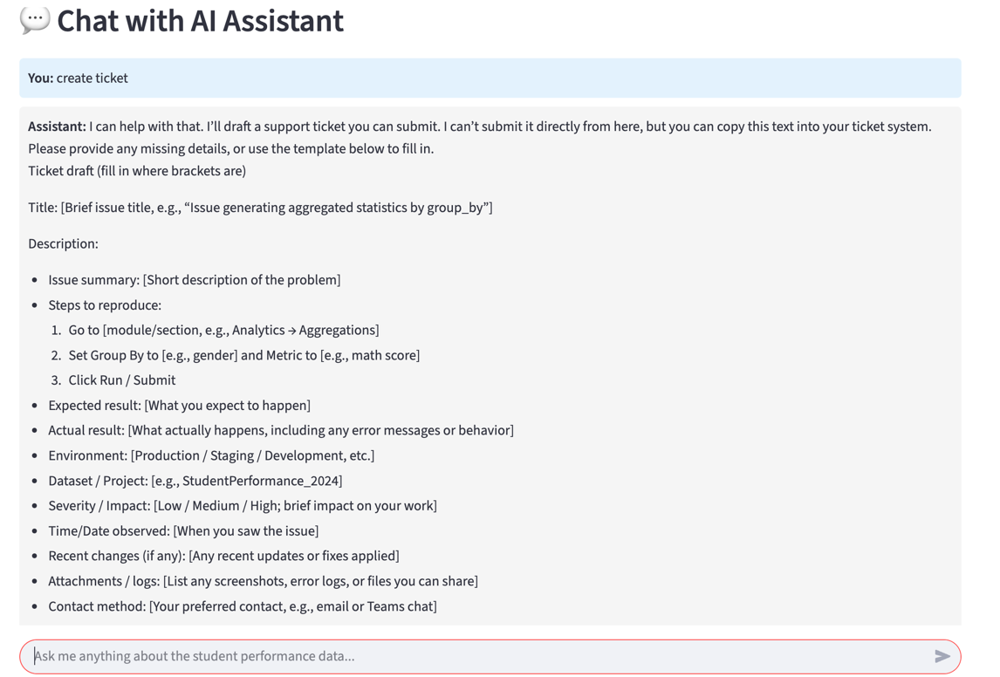
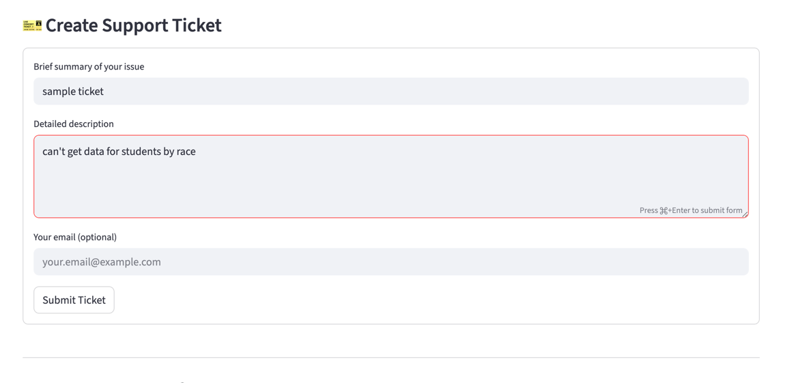

# 🎓 Student Performance Analytics App with AI Agent

An intelligent student performance analytics application that helps users query and analyze student performance data using an AI agent. The application features function calling, safety mechanisms, Trello integration for support cards, and a modern Streamlit UI.

## 🌟 Features

- **AI-Powered Assistant**: Uses OpenAI GPT-5-nano with function calling to intelligently query student data
- **Performance Dashboard**: Visual metrics and charts showing key educational insights
- **Safety Features**: Blocks all write operations (INSERT, UPDATE, DELETE, DROP, TRUNCATE, ALTER)
- **Support Card Integration**: Trello integration for creating support cards
- **Comprehensive Logging**: Detailed console logging for all operations
- **Data Privacy**: Only limited data chunks are sent to LLM, not the entire dataset
- **Interactive UI**: Built with Streamlit for a modern, responsive interface

## 📋 Requirements

- Python 3.12+
- OpenAI API key (GPT-5-nano access)
- Trello account and API credentials (for support card feature)
- CSV data file: `StudentsPerformance.csv`

## 🚀 Installation

### Step 1: Clone or Download the Project

```bash
cd /path/to/project/GenerativeAI/muxammad
```

### Step 2: Install Dependencies

```bash
uv venv python 3.12
uv sync
```

The `pyproject.toml` includes:
- `streamlit` - Web UI framework
- `openai` - OpenAI API client
- `pandas` - Data manipulation
- `plotly` - Interactive charts
- `python-dotenv` - Environment variable management
- `py-trello` - Trello API integration
- `numpy` - Numerical operations

### Step 3: Configure Environment Variables

Create a `.env` file in the project root:

```bash
cp env.example .env
```

Edit `.env` and add your credentials:

```env
# OpenAI API Configuration
OPENAI_API_KEY=sk-your-openai-api-key-here

# Trello Configuration
TRELLO_API_KEY=your_trello_api_key_here
TRELLO_TOKEN=your_trello_token_here
TRELLO_BOARD_ID=your_board_id_here
TRELLO_LIST_ID=your_list_id_here

# Application Configuration
CSV_FILE_PATH=StudentsPerformance.csv
MAX_RESULTS_TO_LLM=20
```

#### Getting API Credentials:

**OpenAI API Key:**
1. Go to https://platform.openai.com/api-keys
2. Create a new API key
3. Copy and paste into `.env`

**Trello API Credentials:**
1. Get API Key: https://trello.com/power-ups/admin
2. Get Token: https://trello.com/1/authorize?expiration=never&scope=read,write&response_type=token&key=YOUR_API_KEY
3. Get Board ID: Open your Trello board, add `.json` to the URL, find the `id` field
4. Get List ID: In the same JSON, find the `lists` array and copy the `id` of your desired list

### Step 4: Prepare Data File

Ensure `StudentsPerformance.csv` is in the project root directory. The CSV should have the following columns:
- **gender**: male, female
- **race/ethnicity**: group A, group B, group C, group D, group E
- **parental level of education**: various education levels
- **lunch**: standard, free/reduced
- **test preparation course**: none, completed
- **math score**: 0-100
- **reading score**: 0-100
- **writing score**: 0-100

## 🎯 Usage

### Running the Application

```bash
streamlit run app.py
```

The application will open in your default browser at `http://localhost:8501`

### Console Logs

The application logs all operations to the console. You'll see:
- Function calls made by the AI agent
- Query execution and results
- Safety checks and blocked operations
- Error messages and warnings

Example log output:
```
2025-11-17 10:30:15 - database - INFO - DataManager initialized with 1001 rows
2025-11-17 10:30:20 - agent - INFO - User message: What are the top 10 students by math score?
2025-11-17 10:30:21 - tools - INFO - Function called: get_top_performers
2025-11-17 10:30:21 - tools - INFO - Parameters: {'subject': 'math score', 'limit': 10}
2025-11-17 10:30:21 - database - INFO - Filter returned 10 results (limit: 10)
```

## 📖 Workflow Example

### 1. Application Startup

When you launch the app, you'll see:
- **Performance Overview Dashboard**: Shows total students, average overall score, score range, and pass rate
- **Data Visualizations**: Charts showing score distributions, gender comparison, parental education impact, test prep effectiveness, race/ethnicity performance, and lunch type impact
- **Sample Queries**: Pre-defined example queries to help you get started


*Main dashboard showing student performance metrics*


*Interactive charts showing score distributions and demographics*


*Detailed performance analysis by various factors*

### 2. Using Sample Queries

Click on any sample query button (e.g., "What are the top 10 students by math score?"):


*Pre-defined sample queries to help you get started*

The agent will process your query and display results with detailed insights.

### 3. AI Agent Processing

The agent processes your query using function calling:
- Agent analyzes the user's intent
- Selects appropriate tool(s) to use
- Executes function calls with parameters
- Returns formatted results with educational insights

### 4. Custom Queries

Type your own questions in the chat input:
- "Show average scores by gender"
- "Compare students who completed test prep vs those who didn't"
- "Find students with all scores above 90"
- "What's the impact of parental education on performance?"
- "Show me students from group A with math score > 80"
- "Analyze reading score distribution"

### 5. Viewing Function Calls

Expand the "View Function Calls" section to see technical details of what tools the AI agent used.

### 6. Creating Support Cards

When the agent suggests human help or you explicitly request it:

1. The agent detects keywords like "help", "support", "bug", "issue"
2. A suggestion to create a card appears
3. Click "Create Support Ticket"
4. Fill in the form with your issue details
5. Submit to create a Trello card


*Support ticket creation form with conversation context*


*Successful ticket creation with Trello card link*

## 🛡️ Safety Features

The application implements multiple safety layers:

### 1. Read-Only Operations
- Only SELECT/read operations are allowed
- All write operations are blocked

### 2. Blocked SQL Keywords
The following operations are prevented:
- `INSERT` - Cannot add new records
- `UPDATE` - Cannot modify existing records
- `DELETE` - Cannot delete records
- `DROP` - Cannot drop tables
- `TRUNCATE` - Cannot truncate tables
- `ALTER` - Cannot alter table structure
- `CREATE` - Cannot create new tables
- `REPLACE` - Cannot replace data
- `MERGE` - Cannot merge data
- `EXEC/EXECUTE` - Cannot execute arbitrary code

### 3. Data Chunking
- Maximum 20 results sent to LLM by default (configurable)
- Prevents overwhelming the LLM context
- Protects data privacy

### 4. Logging
- All operations logged to console
- Blocked attempts are logged with warnings
- Full audit trail for security review

## 🔧 Architecture

### Components

```
┌─────────────────────────────────────────────────────────┐
│              Streamlit UI (app.py)                       │
│  - Performance Dashboard                                 │
│  - Chat Interface                                        │
│  - Support Card Form                                     │
└────────────────┬────────────────────────────────────────┘
                 │
                 ▼
┌─────────────────────────────────────────────────────────┐
│              AI Agent (agent.py)                         │
│  - OpenAI GPT-5-nano Integration                        │
│  - Function Calling Logic                               │
│  - Conversation Management                              │
└────────────────┬────────────────────────────────────────┘
                 │
                 ▼
┌─────────────────────────────────────────────────────────┐
│              Agent Tools (tools.py)                      │
│  - search_students_by_criteria()                        │
│  - get_aggregated_statistics()                          │
│  - get_score_analysis()                                 │
│  - get_demographic_breakdown()                          │
│  - get_dataset_overview()                               │
│  - get_top_performers()                                 │
│  - get_test_prep_impact()                               │
└────────────────┬────────────────────────────────────────┘
                 │
                 ▼
┌─────────────────────────────────────────────────────────┐
│          Data Manager (database.py)                      │
│  - Pandas DataFrame Operations                          │
│  - Safety Checks                                        │
│  - Query Filtering                                      │
└────────────────┬────────────────────────────────────────┘
                 │
                 ▼
┌─────────────────────────────────────────────────────────┐
│              CSV Data Source                             │
│  StudentsPerformance.csv                                │
└─────────────────────────────────────────────────────────┘

        Support Card Manager (support_ticket.py)
                    │
                    ▼
              Trello API
```

### File Structure

```
muxammad/
├── app.py                    # Main Streamlit application
├── agent.py                  # AI agent with function calling
├── database.py               # Data management with safety checks
├── tools.py                  # Function tools for agent
├── support_ticket.py         # Trello card creation
├── utils.py                  # Utility functions and logging
├── config.py                 # Configuration management
├── pyproject.toml            # Python dependencies
├── .env                      # Environment variables (create from env.example)
├── env.example               # Example environment variables
├── StudentsPerformance.csv   # Data source
└── README.md                 # This file
```

## 🎨 Available Tools (Function Calling)

The AI agent has access to 7 tools:

### 1. search_students_by_criteria
Search for students matching specific criteria.

**Parameters:**
- `gender` (string): Student gender
- `race_ethnicity` (string): Race/ethnicity group
- `parental_education` (string): Parental education level
- `lunch` (string): Lunch type
- `test_preparation` (string): Test prep status
- Score ranges for math, reading, writing
- `limit` (integer): Max results

**Example Usage:**
```
User: "Find students from group A with math score > 80"
Agent calls: search_students_by_criteria(race_ethnicity="group A", min_math_score=80)
```

### 2. get_aggregated_statistics
Get aggregated statistics by grouping.

**Parameters:**
- `group_by` (string): Column to group by
- `metric` (string): Column to calculate
- `aggregation` (string): Type (mean, sum, count, min, max)

**Example Usage:**
```
User: "Show average math scores by gender"
Agent calls: get_aggregated_statistics(group_by="gender", metric="math score", aggregation="mean")
```

### 3. get_score_analysis
Get detailed score analysis.

**Parameters:**
- `subject` (string, optional): Specific subject or all
- `gender` (string, optional): Filter by gender
- `race_ethnicity` (string, optional): Filter by race

**Example Usage:**
```
User: "Analyze reading score distribution for females"
Agent calls: get_score_analysis(subject="reading score", gender="female")
```

### 4. get_demographic_breakdown
Get unique values and counts for demographics.

**Parameters:**
- `field` (string): Demographic field to analyze

**Example Usage:**
```
User: "How many students are in each parental education category?"
Agent calls: get_demographic_breakdown(field="parental level of education")
```

### 5. get_dataset_overview
Get overview statistics.

**Example Usage:**
```
User: "Give me a summary of the dataset"
Agent calls: get_dataset_overview()
```

### 6. get_top_performers
Get top N students by score.

**Parameters:**
- `subject` (string): Subject to rank by (or "overall")
- `limit` (integer): Number of students

**Example Usage:**
```
User: "Who are the top 10 students overall?"
Agent calls: get_top_performers(subject="overall", limit=10)
```

### 7. get_test_prep_impact
Compare performance with/without test prep.

**Example Usage:**
```
User: "Does test preparation help?"
Agent calls: get_test_prep_impact()
```

## 🐛 Troubleshooting

### Issue: "Failed to load CSV"
**Solution:** Ensure `StudentsPerformance.csv` exists in the project root directory.

### Issue: "OpenAI API Error"
**Solution:** 
- Check your API key is correct in `.env` or sidebar
- Ensure you have GPT-5-nano access
- Check your OpenAI account has credits

### Issue: "Failed to connect to Trello"
**Solution:**
- Verify Trello API key and token are correct
- Check board ID and list ID are valid
- Ensure you have write permissions on the board

### Issue: No data showing in dashboard
**Solution:** Check console logs for errors during CSV loading

### Issue: Agent not responding
**Solution:**
- Check console for error messages
- Verify API key is entered
- Check internet connection

## 📊 Data Schema

The CSV file should contain the following columns:

| Column | Type | Description |
|--------|------|-------------|
| gender | string | Student gender (male/female) |
| race/ethnicity | string | Race/ethnicity group (A-E) |
| parental level of education | string | Parent's education level |
| lunch | string | Lunch type (standard/free/reduced) |
| test preparation course | string | Test prep status (completed/none) |
| math score | integer | Math test score (0-100) |
| reading score | integer | Reading test score (0-100) |
| writing score | integer | Writing test score (0-100) |

## 🤝 Contributing

To extend the application:

1. **Add new tools**: Add methods to `tools.py` and update `get_tool_definitions()`
2. **Enhance UI**: Modify `app.py` Streamlit components
3. **Add data sources**: Extend `database.py` to support multiple CSVs
4. **Custom safety rules**: Update `DANGEROUS_SQL_KEYWORDS` in `config.py`

## 📝 License

This project is for educational and demonstration purposes.

## 🙏 Acknowledgments

- Built with [Streamlit](https://streamlit.io/)
- Charts by [Plotly](https://plotly.com/)
- Task management by [Trello](https://trello.com/)

## 📧 Support

For issues or questions:
1. Use the in-app support card feature
2. Check console logs for detailed error messages
3. Review this README for troubleshooting steps

---# student-perf-data-analysis-agent
# student-perf-data-analysis-agent
